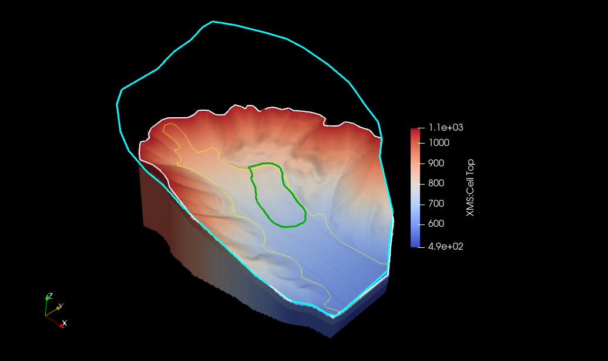

# Shapefile VTK - GIS vectors to VTK for ParaView

**Maintainer:** [Jonathon Brunson](mailto:jonathonbrunson21@gmail.com)

Export ESRI shapefiles (.shp + .dbf) to binary VTK meshes for ParaView, VisIt, or PyVista.

Fork of [paulo-herrera/PyGTV](https://github.com/paulo-herrera/PyGTV). See [ATTRIBUTION.md](ATTRIBUTION.md).

<p align="center">
  
  <br>
  <em>GIS polygons from a shapefile overlaid on a ParaView visualization.</em>
</p>

## Quick start

```bash
pip install -e .
shapeToVTK --help
python src/examples/points.py src/examples/ex1/points.shp
```

## License

MIT - see [LICENSE](LICENSE).